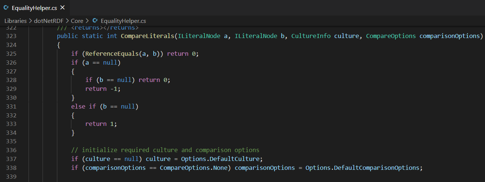
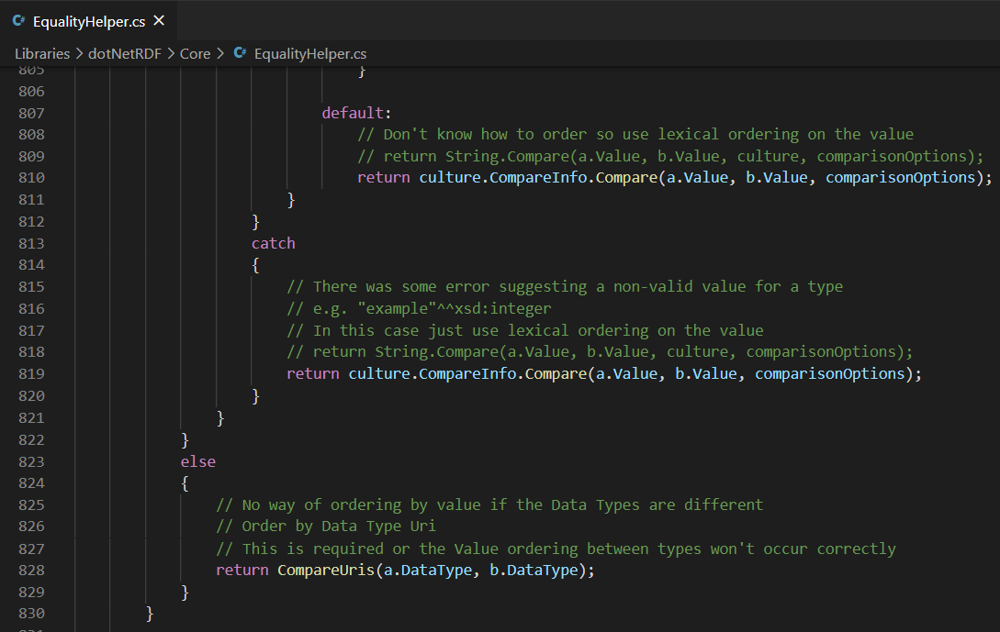
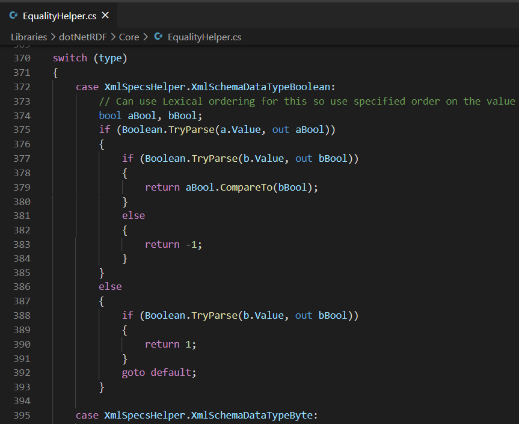
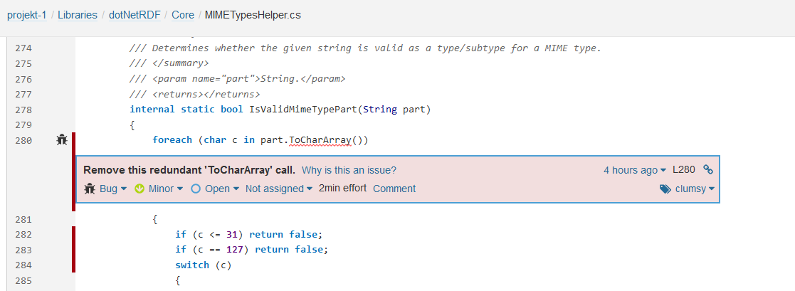
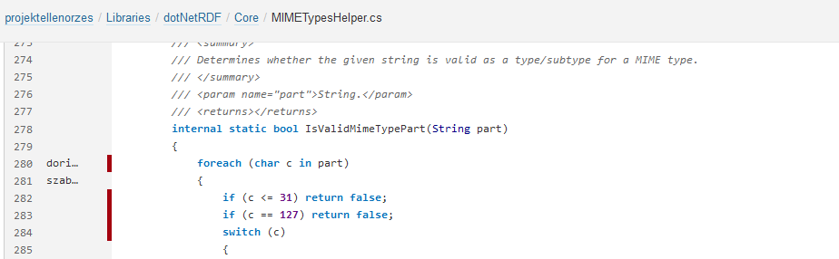
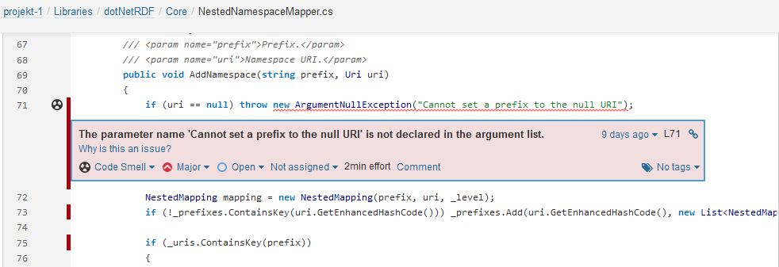
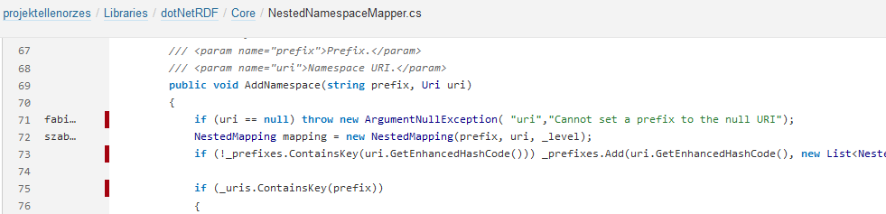

# Manuális és statikus analízis - Simon Dorina Kíra, Fábián Dóra

## Manuális analízis:

A választott projekt egy részét (a Core Library néhány osztályát) manuálisan átnéztük, és összegyűjtöttük a gyanús programkódokat. Mivel nagyméretű projektről van szó, első körben a code smell-eket tudtuk azonosítani, ezekhez megoldási javaslatokat Githubra is felvezettük, ahol lehetett.

### Néhány példa:
1. Nagyon hosszú kód:

A két képből látszik, hogy több száz soros függvényről van szó, ami a clean code elvekkel szembe megy.

2. Goto használata:

A goto használata alapjáraton nem javasolt, potenciálisan követhetetlenné válik az ugrálás.

## Statikus ellenőrzés:

A javasolt eszközök közül a SonarQube volt számunkra a legszimpatikusabb, így annak az asztali verziójának letöltése után futtattuk is a projekten. Ez az eszköz rendkívül részletes információkkal tud szolgálni (még kis címkéket is társít a különböző hibafajtákhoz), ugyanakkor az összefoglaló nézet szintén sokat el tud árulni a kódunk állapotáról. Mondani sem kell, hogy a választott projektünkben - már csak méretéből adódóan is - rengeteg javítási lehetőséget talált. Ezeknek egy részét részletesen átvizsgáltuk, majd néhányra javítási megoldásokat is felvezettünk Githubra. Ez a javítás semmiképpen sem nevezhető teljeskörűnek, ugyanakkor igyekeztünk különböző hibákat vizsgálni.

### Néhány példa:
1. A string maga is egy karaktertömb, végig lehet rajta iterálni, tehát felesleges a karaktertömbbé alakítás, ezt töröljük ki.

Javítás után:

2. Az ArgumentNullException paraméterei közt kellene szerepeljen a hívófüggvény által átvett paraméterek közül valamelyik. Ez mellé lehet csatolni a hibaüzenetet.

Javítás után:

