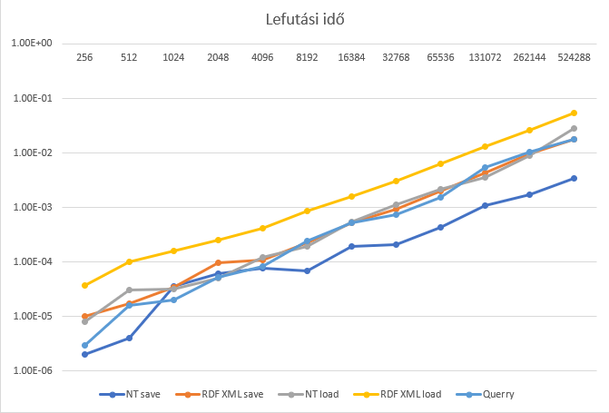
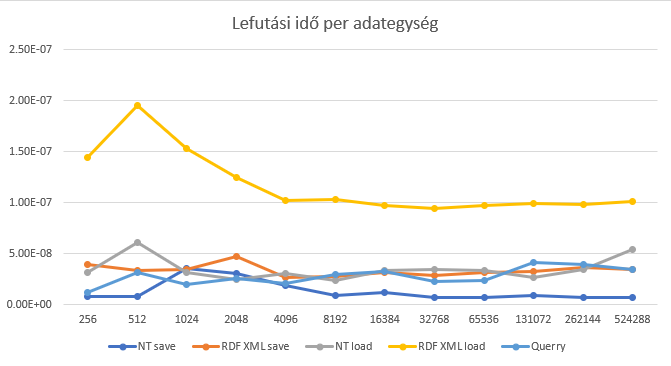

# Nem funkcionális jellemzők vizsgálatának erdményének dokumentlálása

## Vizsgálat módszere:

Teszteltem a könyvtárban a RDF gráf felépítését, annak mentését, betöltését és lekérdezését. Írtam egy PerformanceTester nevű osztályt, amely létrehoz egy gráfot, ahol a megadott szám mennyíségű entitást hoz létre.
Minden entitásnak van egy ismerőse(URI URI URI kapcsolat) és egy kedvelt száma (URI URI literal kapcsolat). 

A gráf egy Graph típusban van eltárolva. Az osztályban van egy függvény, amely kimenti és betölti az adatokat nt és xml rdf típsú adat egységbe. Az írást a "NTriplesWriter" és "RdfXmlWriter"-el oldottam meg. A .rdf fájl beolvasását a FileLoader statikus .Load fügvényével oldottam meg, a .nt beolvasását a NTriplesParser-el odottam meg.

A querry-zéshez létrehoztam egy "TripleStore" objektumot és azt feltöltötem a gráffal. Létrehoztam egy "SparqlQueryParser" a sparql lekérdezések parse-olásához és létrehoztam ezzel egy "SparqlQuery" objektum-ot. 
Lefuttattam a lekérdezést a TripleStore-on a ExecuteQuery metódussal. 
A lekérdezés amit futtattam: 
- `CONSTRUCT { ?s ?p ?o } WHERE { { ?s ?p ?o } UNION { GRAPH ?g { ?s ?p ?o } } }`

Minden tesztnek a lefutásának az idejét mértem.

## Használhatóság:
A könyvtár könnyen használható a dokumentációt felhasználva. A dokumentáció könnyen követhető, de tartalmaz olyan kód példákat, ami már újabb verziókban nem futtatható.

## Teljesítmény:
Teljesítmény tesztnek az az erdménye, hogy a könyvtár relatíve gyorsan fut, de az .nt típusú tárolás lényegesen gyorsabb mint az xml-es.

(képen az y tengely: ms, x tengel: entiások száma)

## Stressz teszt:
Az Entitások számának növekedésével nem nőtt meg az egységnyi entitásra mért futási idő, de 524288 entitástól kezdve már lassan futtott a teszt program, mert nem sikerült elegendő memóriát alokálnia a feladatokhoz. 
Ott 7.8 GB-ra volt szükség.

