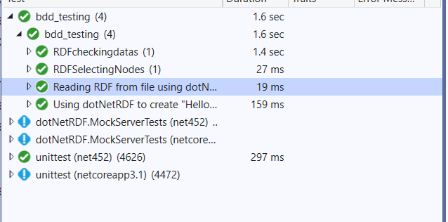

#  BDD testing:

Az ajánlott frameworkök közül a SpecFlow-ot választva Gherkin nyelven, 4 Fő feature-ét teszteltem.

+Gráf beolvasása
+Gráf kiírása(mentése)
+Gráf elemek (nodes) lekérdezése
+Gráfban tárolt adatok lekérdezése
+Sparql query létrehozása

A tesztek futása közben egy fájlt is létrehozunk "hello_world.rdf" néven.

Teszt eredmények:

